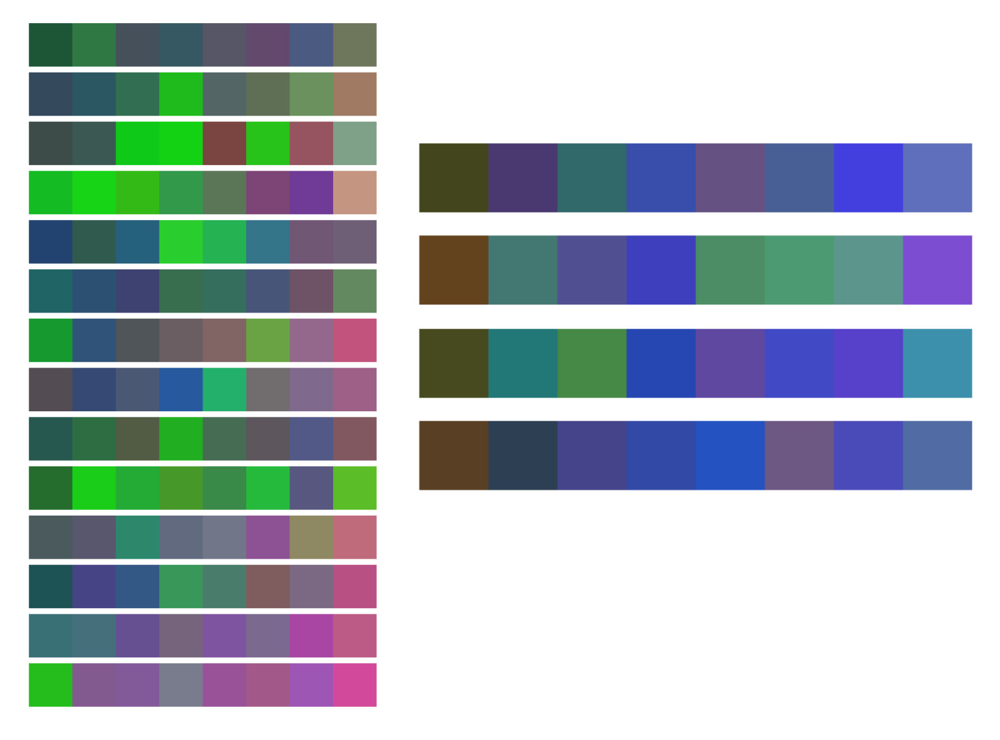

ofxSomPalette
=============

Create 2D and 1D colour palettes from 3D data.

Introduction
------------
Uses a [Self-organizing_map](https://en.wikipedia.org/wiki/Self-organizing_map)
via [ofxSelfOrganizingMap](https://github.com/genekogan/ofxSelfOrganizingMap)
to convert a stream of normalised 3D data into a colour palette. Work is done
off the main thread. Continuously-changing palettes can be created to avoid
settling early into one arrangement.

Two continuous palettes are shown: both created from 3 dimensions of audio data.
The left column was made from a longer trombone solo and the right column was
from a short violin solo.

License
-------
ofxSomPalette is distributed under the [MIT License](https://en.wikipedia.org/wiki/MIT_License). See the [LICENSE](LICENSE.md) file for further details. Just add my name somewhere along your project [Steve Meyfroidt](https://meyfroidt.com) whenever possible.

Dependencies
------------
- [ofxSelfOrganizingMap](https://github.com/genekogan/ofxSelfOrganizingMap)

Compatibility
------------
Developed against OpenFrameworks v0.12+.
